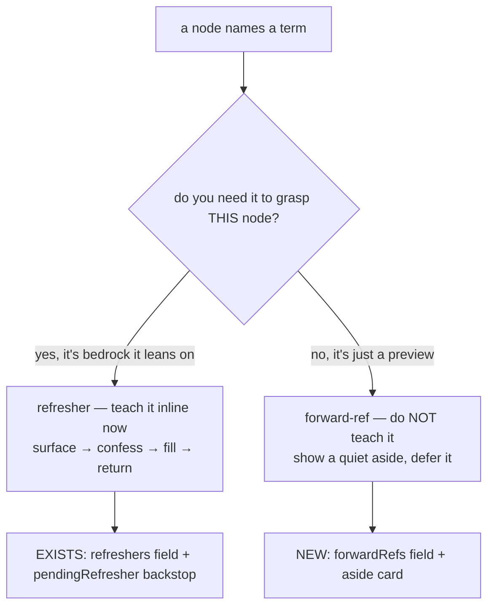

# just for 10

a small holding pen. fixes + schema changes get tried on **10 nodes first**, not the whole
corpus. iterate fast on these, watch them in the real app, and only roll a change out once it
actually feels right here.

this is the registry: which 10 nodes are in the pen, and which changes we're piloting on them.

> twin doc — `just for 10.html` is the same thing for the browser. edit one, mirror the other.
> this is the **maths** mirror of the IE doc. the engine is shared (`src/core/node-agent.ts`,
> `src/web/components/NodeView.tsx`), so every change here matches `../bottom_up_IE/just for 10.md`
> — same schema, same render — just authored onto maths nodes. anything done there gets done here.

---

## the 10 nodes (maths)

first 10 nodes of **`content/cbse10/maths/jemh101/`** — chapter 1, Real Numbers. good pilot chapter:
node 0 openly names theorems it doesn't prove yet, so it's a natural forward-reference case.

| # | slug | title |
|---|------|-------|
| 0 | `apply-real-number-theorems` | Apply the Fundamental Theorem of Arithmetic and irrationality results ← forward-refs FTA + irrationality |
| 1 | `prime-factorise-integer` | Factorise a composite number into a product of primes |
| 2 | `state-fundamental-theorem-arithmetic` | State the Fundamental Theorem of Arithmetic |
| 3 | `decide-ends-with-digit-via-primes` | Decide whether a power can end in a given digit |
| 4 | `compute-hcf-prime-factorisation` | Compute HCF from prime factorisation |
| 5 | `compute-lcm-prime-factorisation` | Compute LCM from prime factorisation |
| 6 | `use-hcf-lcm-product-relation` | Use HCF(a,b) × LCM(a,b) = a × b |
| 7 | `state-prime-divides-square-theorem` | State and apply Theorem 1.2 (p \| a² ⇒ p \| a) |
| 8 | `set-up-contradiction-rational-assumption` | Set up an irrationality proof by contradiction |
| 9 | `derive-square-relation-from-fraction` | Square and rearrange to get the divisibility relation |

full id form: `cbse10:maths:jemh101:<slug>`.

**why this is safe on 10 only:** every schema change here is **additive + optional**. a new field
authored into these 10 `content.json` files just isn't present on the rest of the corpus — the
loader and engine no-op when it's missing. no pilot flag, no branch. the 10 simply have richer data.

---

## changes being piloted

### 1. forward-reference asides  ·  status: proposed

**the problem (corrected — sharper than first read).** the fault is **not** just that node 0 names
the *Fundamental Theorem of Arithmetic* and *irrationality results* before they're stated (FTA lands
in node 2; irrationality in nodes 7–9). it's that **keyMove #2 makes the learner demonstrate them**:

> "Invoke the appropriate theorem (FTA, Theorem 1.2) explicitly"

the engine drives the tutor at the next undemonstrated key move and demands the *learner* show it in
their own words — so the tutor will try to get the learner to name/apply theorems they were never
taught. **that assumes knowledge the learner can't have yet — a DON'T-ASSUME violation.** same shape
as IE node 1. (this "apply everything" node sitting *first*, before its pieces, is part of why.)

**so the fix is two layers — (A) is the real one:**

- **(A) reshape keyMove #2** so the learner demonstrates the *idea* (e.g. "pick which tool the problem
  needs"), NOT naming theorems that haven't been stated.
- **(B) the forward-ref aside** then presents those theorem names honestly: previewed, not required
  now, stated/proven in the next nodes.

**the key distinction** (this is the actual idea):



teaching a forward-ref inline (refresher-style) would be **wrong** — it'd drag the FTA proof into a
node whose job is just to *use* the result. the right move is to *acknowledge and defer*.

**the schema** (additive, on the node in `content.json`):

```json
"forwardRefs": [
  {
    "terms": ["the Fundamental Theorem of Arithmetic", "irrationality results"],
    "why": "named here only to show what these results let you DO — you'll meet the statements and proofs in the next few nodes",
    "later": "we state the FTA next, and prove the irrationality results a bit after that",
    "coveredIn": [
      "cbse10:maths:jemh101:state-fundamental-theorem-arithmetic",
      "cbse10:maths:jemh101:state-prime-divides-square-theorem"
    ]
  }
]
```

`coveredIn` is the trust mechanism: a list of **real downstream node ids** that actually teach the
term. validated at load → if a "we'll cover it later" promise points nowhere, the build fails. the
promise is checkable, not hopeful.

**how it fires.** reuse the refresher machinery (`termAppears` guarded-term match in node-agent.ts).
when a tutor turn first surfaces a forward-ref term that hasn't been acknowledged yet, emit a
`forward_ref` aside — **once per group**. the aside text is the authored `why`/`later`, never
model-generated, so the model can't invent a promise it can't keep.

**the UI.** a new `Msg.kind === 'aside'` branch in NodeView, mirroring the existing `kind: 'recap'`
card — a quiet bordered note, the terms as chips, the authored copy. shared NodeView → lands in both
repos from one change.

**the voice** — chosen: the peppy "champ" voice.

> hey champ — no worries: the *Fundamental Theorem of Arithmetic* and these *irrationality results*
> are brand new. we're only using them here to see what they're good for; we'll state and prove them
> in the next few lessons. you've got this, champ.

---

## pieces / choices

| piece | choice now | why | later / alt |
|---|---|---|---|
| detect a forward-ref | reuse `termAppears` guarded-term match | same deterministic path as refreshers; model-independent | let the model emit a flag (less reliable) |
| aside content | authored in `forwardRefs`, never model-written | a "covered later" promise must be true, not improvised | — |
| `coveredIn` | list of downstream node ids, validated at load | makes the promise checkable; dead link fails build | advisory-only at first, enforce later |
| rollout | additive optional field, on the 10 only | absent field = no-op; no pilot flag needed | promote corpus-wide once happy |
| render | new `Msg.kind: 'aside'` card, mirrors recap | shared NodeView → both repos in one change | — |
| **keyMove #2** | reshape to the *idea*, pull the theorem names out | a key move must not demand undefined theorems the gate never tests | — |

---

## decisions to talk about

- **voice** — settled: peppy "champ" voice.

1. **trigger timing** — fire the aside the moment a term is surfaced, or once at node-open listing
   all of the node's forward-refs up front?
2. **`coveredIn` strict or advisory** — fail the build on a forward-ref with no downstream teacher,
   or just warn?
3. **prose** — leave the naked term in the node text (+ aside), or also flag it as "coming later" in
   the wording itself?
4. **keyMove #2 rewrite** — exact replacement wording for "Invoke the appropriate theorem (FTA,
   Theorem 1.2) explicitly"? draft: *"choose which result the problem calls for"* — good?

---

## how we use this doc

- each new fix/schema idea → add a `### N. <name> · status: proposed` block here first.
- author it into the 10 nodes, watch it in the app, iterate.
- once it's right: flip status to `shipped (pilot)`, then plan the corpus-wide rollout separately.
- **keep this in lockstep with `../bottom_up_IE/just for 10.md`** — same engine, same changes.
