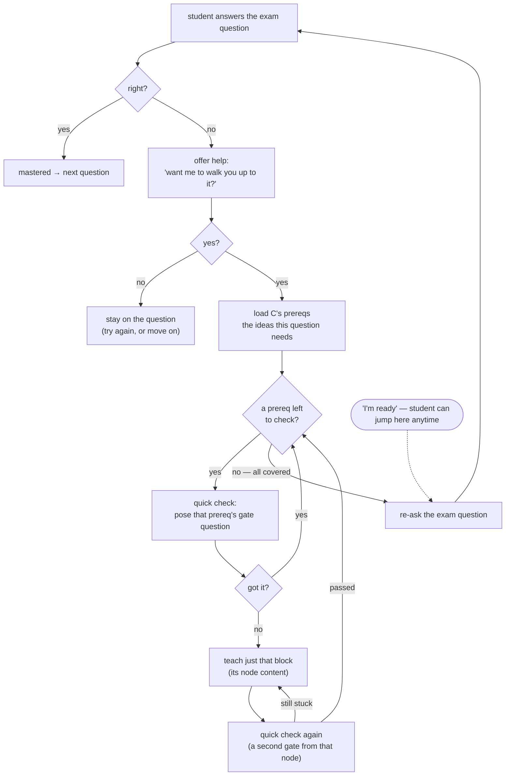
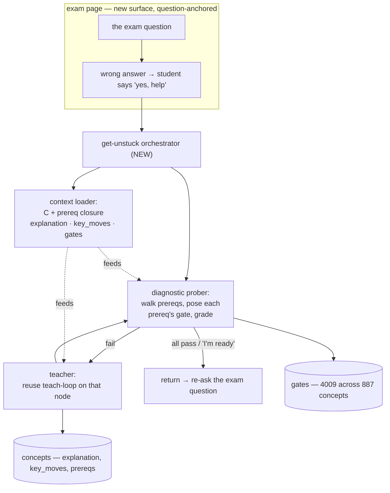

<!-- Twin of exam-mastery-loop.html. Edit one, mirror the other. Diagrams: Mermaid. -->

# Exam Mastery Loop — get unstuck on a real exam question

updated 2026-06-26 · plan + decisions for the exam page redesign

> framing rule: **designed** = an idea · **built** = code exists · **verified** = we checked the data / watched it work. nothing is called "working" without evidence behind it.

---

## the plan

- the exam page isn't a test you just pass or fail. when you get a question wrong, it offers to teach you the **exact** thing you're missing, then hands the question back.
- we already know which concept every exam question tests — it's wired into the paper (the `node` on each question). and we know that concept's **prereqs**: the building blocks you need to answer it.
- so when you get one wrong and say yes to help, we don't dump a whole lesson. we **quiz you on the prereqs one at a time** to find the block you're actually missing, teach just that, confirm you've got it, and loop until every block is solid — then you retry the real question.
- all of it narrated out loud so you know why (see "what we say to the student").

## the rules that don't bend

- **help is offered, not forced** — a wrong answer triggers an *offer*; we only enter the loop once the student says **yes**. right answer → straight on, no detour.
- **transparent** — always say what we're doing and why ("this question's built on a few ideas; let me check which are solid").
- **diagnose before you teach** — never re-teach a block the student already knows. quiz first; only teach on a miss.
- **teach only the missing block**, not the whole tree.
- **confirm with a *second* check** before moving on — a different question, so it's understanding, not memory of the last answer.
- **the exam question is the anchor** — every detour returns to it and re-asks it.
- **escape hatch** — the student can retry the exam question **any time they feel ready**; the loop never traps them.
- this is a **different surface** from a teaching node (see "the exam page ≠ a teaching node").

## the loop



## what we say to the student

the student never hears "gate" or "prereq node" — internally they're gates; **to the student a gate is a "quick check."** the voice is plain, warm, lowercase. draft copy:

- **on a wrong answer (the offer):** *"not quite. this question is built on a few specific ideas — want me to walk you up to it?"*
- **on yes (entering the loop):** *"great. this one rests on a handful of ideas. i'll give you a quick check on each — wherever you're rusty i'll teach just that piece, then we keep going. once they're all solid you'll take the question again. and you can jump back to it any time you feel ready."*
- **each check:** *"quick check on [topic] —"* then the question.
- **on a miss → teaching:** *"no worries, let's nail [topic]."* …teach… then *"okay, quick check again —"*
- **on all covered → re-ask:** *"you've got all the pieces now. here's the question again."*
- **the escape-hatch button (always visible in the loop):** *"I'm ready — let me try the question now"*

---

## the technical side

### the data we're standing on

all checked against the live DB (`bottom-up-exam-prep`) + the 5 paper files on 2026-06-26.

| fact | numbers | state |
|---|---|---|
| every exam question maps to a concept | 173 / 173 questions, 90 distinct concepts | **verified** |
| those concepts are real authored nodes | 90 / 90 exist · 0 unauthored stubs | **verified** |
| each carries prereqs (the required knowledge) | 88 / 90 · avg **4.2** direct prereqs | **verified** |
| the mapped concepts have gate questions | 90 / 90 · 371 gates total | **verified** |
| their prereqs are authored **and** gated | **334** distinct prereqs · 334 exist · 0 stubs · **334 have gates (100%)** | **verified** |
| gate-posing already runs (in teaching) | `/node/:id/gate` + `/gate-answer` routes, grader wired | **built** |
| inline exam help: prober · teach-in-place · return | — | **designed** (not built) |

the headline: **every building block of every mapped exam question is an authored node with quiz questions ready to probe.** the loop is buildable on what already exists — the gap is the orchestration + the page, not the content.

### what's there today (and what we're replacing)

- today the exam page (`PaperView`) lets you sit a paper, grades each answer, and on the result screen shows weak-concept chips. answered questions also get a "↻ Refresh this concept" button.
- both that button and the chips **bounce you out to the teaching node** (`NodeView`) — you lose the exam entirely. that jump *is* the "clicking just makes the page refresh / yanks me away" feeling.
- the redesign **replaces the bounce with help that happens in place, on the question.**

### how the pieces fit



reused as-is: the `gates` table + grader, node content (`explanation` / `key_moves` / `misconceptions`), the teach-loop. **new:** the orchestrator that sequences prereq probes around an exam question, and the question-anchored page.

### a student getting stuck (walkthrough)

```mermaid
sequenceDiagram
  actor S as student
  participant E as exam page
  S->>E: answers the question — wrong
  E->>S: "not quite. this question's built on a few ideas — want me to walk you up to it?"
  S->>E: "yes"
  E->>S: "it rests on a handful of ideas. quick check on each; I'll teach what's rusty, then you retry."
  E->>S: "quick check on [p1] — …"
  S->>E: wrong
  E->>S: teaches p1, then "okay, quick check again — …"
  S->>E: correct
  E->>S: "nice. next — quick check on [p2] …"
  Note over E,S: …loop; student may tap "I'm ready" to retry anytime…
  E->>S: "you've got all the pieces. here's the question again."
  S->>E: answers correctly → mastered
```

### the exam page ≠ a teaching node

- a **teaching node** walks **one** concept linearly to mastery: explain → gates → pass. one subject, one thread.
- an **exam question** sits at the **convergence of several** concepts (avg ~4 prereqs) and only teaches the ones the student actually trips on, found by probing.
- so the surface is **question-anchored, diagnostic-first, branchy** (it hops between prereq nodes) and always **returns to the question** — not a linear single-node lesson.
- it reuses node content + gates, but the control flow is different → its **own page/component**, not `NodeView`.

### pieces & choices

| piece | choice now | why | later / alternative |
|---|---|---|---|
| knowledge graph | **prereqs** (not forward_refs) | 88/90 have prereqs; forward_refs is ~empty (8 nodes) | enrich forward_refs if a question needs non-prereq context |
| trigger help | **wrong answer → offer → student confirms** | help is opt-in, never forced | a "help me" button before answering; auto-detect struggle later |
| diagnostic probe | pose the prereq's **existing** gate question (shown as a "quick check") | gates already authored + graded; 100% prereq coverage | adaptive question pick |
| which prereq first | walk C's direct prereqs in stored order; recurse only if a prereq fails its own gate | keeps it shallow + cheap (~4 probes/question) | mastery-history-aware / binary-search ordering |
| teaching a missing block | reuse node content via the existing teach-loop | already built + tuned | exam-specific micro-lessons |
| confirm understanding | a **second** gate from the same node | tests understanding, not recall of the last answer | vary difficulty / tier |
| escape hatch | **"I'm ready"** retries the question anytime, skipping the rest | student agency; never trapped | resume the loop where it left off if still wrong |
| return | re-pose the **same** exam question, student retries | the anchor; closes the loop | track whether the loop worked (right after?) |
| the page | new question-anchored surface, not `NodeView` | different control flow | — |
| depth cap | **direct prereqs only** at first (don't recurse the whole DAG) | avoid infinite descent | go a level deeper when a prereq's prereq is the real gap |

### decisions to talk about

**D** = decided · **O** = open.

| # | decision | choice | status |
|---|---|---|---|
| 1 | the knowledge graph | use **prereqs**; park forward_refs (8 nodes vs 958 with prereqs) | D |
| 2 | how we diagnose | probe with the prereq's existing node **gate** questions (shown as "quick checks") | D (100% prereq gate coverage verified) |
| 3 | confirm step | a **second** gate from the taught node before moving on | D |
| 4 | the exam page is its own surface | yes — question-anchored, not `NodeView` | D |
| 5 | what triggers help | **wrong answer → we offer → student confirms** (no auto-detect for now) | **D** |
| 6 | escape hatch | student can retry the question **any time they're confident**, skipping the rest of the loop | **D** |
| 7 | probe order & depth | direct prereqs, stored order, recurse-on-fail | O — smarter ordering / deeper? |
| 8 | does exam practice count toward node mastery? | reuse `bu_node_performance` / `bu_gate_attempt` so it does? | O |
| 9 | how much node content to load as context | full `explanation` vs `brief` (cost vs richness) | O |
| 10 | MVP slice | one exam · one question end-to-end · direct-prereq probes | O — pin the first cut |

> next step after we agree on the remaining **O**s (7–10): I scope the MVP slice (#10) and we build the orchestrator + the page against one question first.
